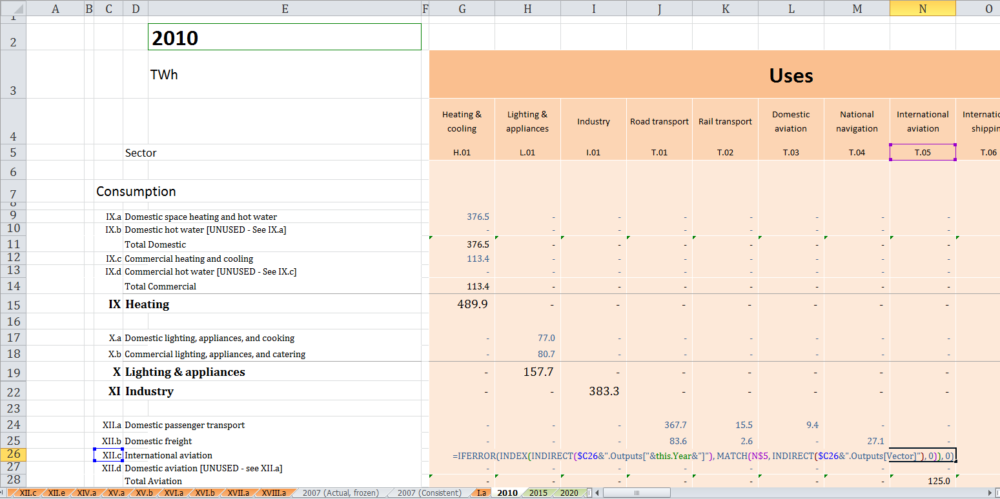

# Appendix 2: Complex Excel formulae

The calculator makes extensive use of complex formulae which combine a number of different worksheet functions. A common example can be seen in the year sheets, where information is gathered together from across all of the sector sheets. This is done by way of a ‘lookup’ based on three criteria, which specify the point from within the model that a value should be returned. In the case of the year sheets the three criteria are the sector (e.g. II.a), the vector (e.g. V.02) and the year (e.g. 2010). In order to perform a lookup in Excel based on three criteria it is necessary to use a number of worksheet functions in conjunction.
Below some of the commonly used Excel formula and formatting conventions are explained in isolation and then in combination.

## Index

The index function has three arguments. This first argument is an array (C3:K5 in the example here). The second and third arguments respectively are row and column indexes which specify an element from the array that should be returned. Here, the index function returns the value 12, which is in the 3rd row and 6th column of the C3:K5 array.

## Match

The match function returns the position of the item specified by the first argument (here the year 2035, as stipulated in cell B9), within the range (here C2:K2) specified by the second argument. The third argument (here 0) determines that a precise match is required when the function is searching for the item in the range.

## Index and match

In the above example the row and column arguments of the index function have been substituted with match functions. Using index and match in combination like this is useful, as it allows you to return an element from a table by knowing the corresponding row and column labels (here ‘Bus’ and ‘2035’), without the need to know the precise row and column numbers of the element. This example also contains an index function, which here is used to specify the index function’s array indirectly via the contents of cells B7 and B8 – note that the formula makes use of some string manipulation syntax (i.e. B7&":"&B8) to construct the required Excel range reference (C4:K6). The resulting function returns the value 10, i.e. the value in the 2010 column of the Bus row.

## Structured table references

In Excel 2007 a new way of formatting tables was introduced that makes it possible to format a block of data sothat Excel will recognise that it is a table. This can be done using the ‘format as table’ button on the ‘home’ tab of the ribbon. Once a table has been formatted in this way, it is possible to refer to components of the table using ‘structured references’. This is demonstrated in the example above, where the formula in cell M5 is referring to a specific column, i.e. the 2045 column, as specified in the square brackets, of the table. The name of the table, here ‘Table2’, is also referred to explicitly in the formula.

## Putting it all together: index, indirect, match and structured references

Many of the formulae in the calculator make use of the functions listed above in combination with structured references. This section provides an example together with an explanation.

The formula in cell N26 of the 2010 year sheet as shown in Figure X above reads as follows:

=IFERROR(INDEX(INDIRECT($C26&".Outputs["&this.Year&"]"), MATCH(N$5,INDIRECT($C26&".Outputs[Vector]"), 0)), 0)

The formula is broken down into two sections, purple and green, which are explained in turn below:

INDEX(INDIRECT($C26&".Outputs["&this.Year&"]") : This provides the array to be used in the overall index function. Firstly, the contents of cell C26 (XII.c) is appended, using the ‘&’ string manipulation syntax, to the string, ‘.Outputs[‘. This is then appended to the contents of a cell named ‘this.year’, which here contains the year ‘2010’. Finally a closing square bracket ‘]‘is appended. Theresult effectively yields the following structured reference: ‘XII.c.Outputs[2010]’, which refers to the 2010 column of the named outputs table at the bottom of sector XII.c. This is all done within an indirect function, which is not in itself theoretically required, but is included as a workaround (the formula for some reason doesn’t work without this).

MATCH(N$5,INDIRECT($C26&".Outputs[Vector]"): This match function which specifies the row from which the overall index function should return a value. (As the range from which to return the value is only a single column, a columnreference is not required). The match function looks for the contents of cell N5, which here is the vector label ‘T.05’. The range in which the match function looks for ‘T.05’ is constructed in exactly the same way in which thearray for the index functionabove. This effectively yields the following structured reference: ‘XII.c.Outputs[Vector]’. Thematch function therefore returns the position of the text ‘T.05’ within the column labelled ‘Vector’ in the outputs table of sector XII.c.

In effect,the formula is completing a lookup based on the three criteria: the year, the sector and the vector. It retrieves a value from the outputs table of the specified sector according to the row and column that correspond to the respective specified vector and year.

The index function is nested within an ‘iferror’ function, which returns a ‘0’, rather than an error message if the formula cannot find a value that corresponds to the year, sector and vector criteria specified.

