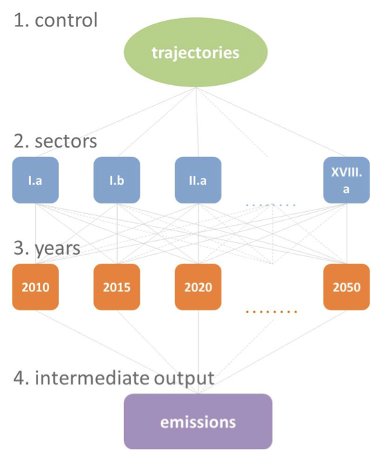
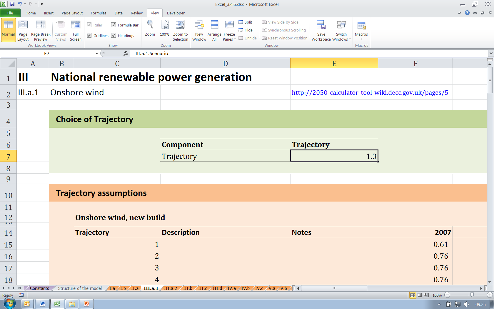
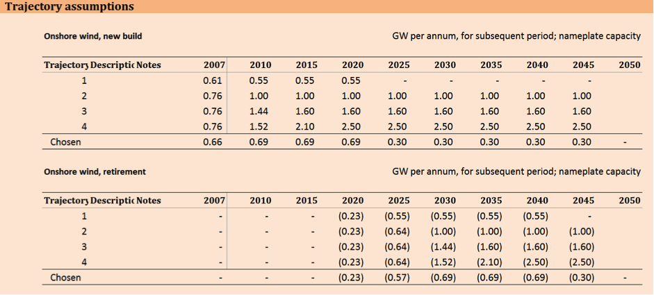
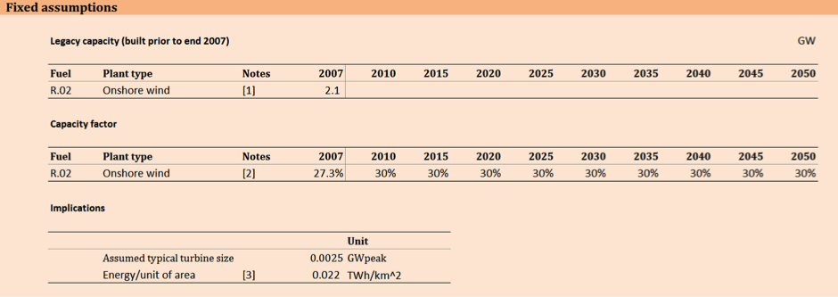
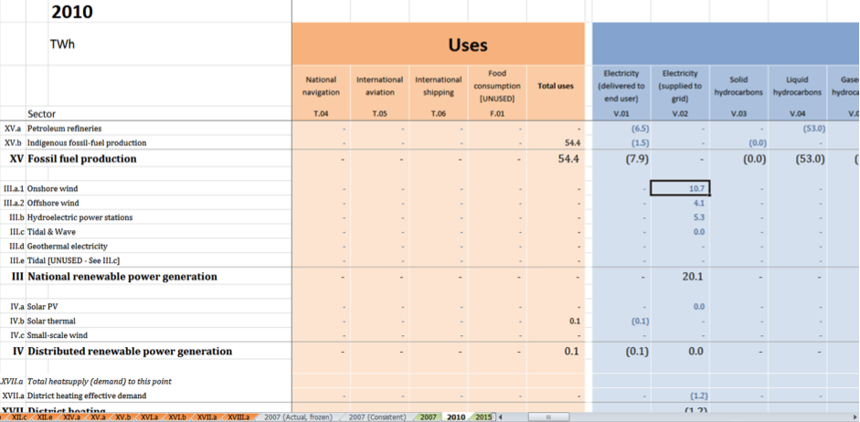

# Appendix 1: The Excel model structure

## Introduction

This appendix provides an overview of the Excel calculator structure, followed by a more detailed explanation of each section. Finally,it explains the Excel formulae that are used extensively to ‘glue’ the model together, by passing relevant values to required places.

## Overall structure

Figure 0 above provides a summary of the way in which the Excel model is structured and how the user’s choices flow through the chain of calculations. The user interacts with the ‘control’ worksheet, where they make level selections (from 1 to4) for all of the mitigation options. Broadly, these level selections feed through to separate sector sheets where the implications of the user’s choice (in terms of energy supply/demand and any associated emission)are calculated. The results for each sector are then pulled together to produce a full-system overview. This is done in two stages, firstly by each of the five year intervals in the ‘year sheets’. Finally,all of the sectors for all of the time intervals are drawn together in the ‘intermediate output’ worksheet. The four main sections as shown above are described, in turn, below.

## The control sheet

The control sheet is the main user interface. From this single worksheet the user can develop their pathway and see the implications in charts showing energy demand, energy supply and emissions.

The different greenhouse gas (GHG) mitigation actions, or ‘levers’, are listed in columns A to D (see the area labelled ‘A’ in figure 1). The levers are organised by category, with each having its own Roman numeric code (e.g. III.a.1 for onshore wind).

The user assigns their choice of level against each lever by entering a number from 1 to 4 into column E. The supply side levers allow integer choices (e.g. level 1.7).  (It is possible to use integers for the demand levers if implemented within the sector sheets, but this has not been done in the UK Calculator demand sectors.)The cells into which the numbers are entered are ‘named cells’, e.g. cell E10, in which the chosen level for onshore wind must be entered is named ‘III.a.1.Scenario’. This allows this cell to be referenced from elsewhere, using this label, e.g. ‘=III.a.1.Scenario’, rather than ‘=Control!E10’.

Columns H to K provide descriptions of each level to assist users in their choice (see area C in figure 1below). For example, with the III.a.1 lever, the user is choosing the capacity of onshore wind to be installed by 2050, from 0 turbines (level 1), to 20,000 turbines (level 4).

The implications of the user’s choices, in terms of primary supply, demand, electricity and emissions appear in the charts (shown in area E in figure 1 below).

Example pathways are shown in columns M to Y (see area D in figure 1below). To enter these, the user must copy the values from the desired column into column E.

<!-- Video? -->

## Sectors

The 2050 Calculator is split into different supply- and demand-side ‘sectors’. There are, broadly, separate sectors for each supply technology and each area of demand, with each having its own worksheet, or ‘sector sheet’, within the Excel workbook. There are around 40 sector sheets in the model; each worksheet tab is labelled with the Roman numeral identifier that corresponds to those given in the control worksheet (column C). The sector sheets are all grouped together in the workbook and have orange tabs.

When a user specifies a level of effort against a particular lever (by entering a value from 1 to 4), this is passed to the model’s ‘sector sheets’. Each sector sheet contains a mini model that calculates the implications of the level selected by the user. The principal function of the supply side sectors is to calculate the resulting amount of electricity generated by the technology in question, given the capacity of that technology specified by the user when they make their level choice against it. The demand side sectors similarly calculate the energy/fuel requirement associated with the user’s choices, but also calculate any resulting emissions.

The sector sheets are split up into a number of different sections. The same sections are used consistently and are common to all of the sectors. Accordingly, all of the sector sheets look very similar and work in a standardised way, making it easier to understand the model. Each of the standardised sections is explained in more detail below, using onshore wind (worksheet III.a.1), as an example.

### Choice of trajectory

For example, when the user enters a level (here 1.3) into cell E9 of the control sheet (named III.a.2.Scenario), it feeds through to cell E7 of the ‘choice of trajectory’ section of the III.a.2 worksheet, as can be seen from the formula in the screenshot below (figure 2).

### Trajectory assumptions

Each sector sheet also has a ‘trajectory assumptions’ section, where the level selection number (1-4) is converted into what the lever actually specifies. For the onshore wind example, this is the GW of capacity installed. It is important to note that the capacity values in the table are multiplied by a named cell (here ‘unit.GW’), which corresponds to the units which the values represent. See the [appendix on units](#appendix-4-units) for a full explanation.

### Fixed assumptions

The ‘fixed assumptions’ section is where all required assumptions are stated that are outside of the user’s choice. 

Legacy capacity
: the existing installed capacity of onshore wind turbines already existing at the start of the modelling period. 

Capacity factor
: the average proportion of time that the turbines operate at their quoted capacity, incorporating both down-time for maintenance and fluctuations in wind speed over the year.

Implications
: details about the assumed size of wind turbine and the amount of land area required for each unit of energy produced.

### Derived assumptions

The trajectory assumptions and fixed assumptions mentioned above are combined to produce the values contained within the next section of the sector sheet, the ‘derived assumptions’.

In our example case of onshore wind, the derived assumptions section is very brief, showing only the resulting capacity of installed wind in each of the modelled periods out to 2050. This is calculated by starting with the existing legacy capacity stated in the fixed assumptions and then applying the quantityof newly built capacity from the trajectory assumptions section, as determined by the user’s chosen level of effort (1-4), as displayed in the choice of trajectory section. The corresponding retirement rate from thetrajectory assumptions section is also applied, to account for the assumption that wind turbines have a finite lifetime.

### Calculation section

The calculation section (which isn’t really labelled, but sits below the derived assumptions section) is where the main energy arithmetic takes place, to calculate the pertinent implications of the user’s choice. In our onshore wind example, we are primarily interested in the amount of electricity supplied to the grid that results from the chosen wind turbine generation capacity. The calculation steps required are set out in such a way as to keep them as simple as possible, by using a few guidelines:

- The flow of calculations is from top to bottom, with all references being made to cells above
- Where useful, values are restated from above, making then visible within the main block of calculations, preventing the user from needing to scroll up the worksheet
- Each step logically follows the previous step, creating an intuitive calculation path
- The values in each row are labelled so the user can easily see to what they refer
- A new row is used for each calculation step, so that only one identifiable function is being performed in each

Some of the more complex sectors have many rows of calculations in this section, but following these principles, it is intended that the user can follow them as easily as possible. In our example case of onshore wind a small number of calculations are required to arrive at the desired results, which are outlined below:

1. The installed capacity as calculated in the derived assumptions is restated, enabling the user to view this key value without having to scroll up the worksheet
1. The capacity factor, as stated in the fixed assumptions section is restated, again allowing the user to view this without the need to look further up the worksheet
1. The ‘available supply ‘ is calculated by multiplying the two values above (the installed capacity and the capacity factor)
1. The electricity generation resulting from the ‘available supply’ is then calculated. This a typical power to energy conversion where:
   1. The ‘actual supply’ is multiplied by the Preferences.Unit.Power named cell, to account of the unit of power in which the value is quoted
   1. The result from step ‘a’ is then multiplied by the number of seconds in a year, by utilising the ‘unit.year’ named cell. This yields the number of joules produced by the capacity each year.
   1. The result of step ‘b’ is then divided by the named cell ‘Preferences.Unit.Energy’, which converts the result into the energy units that the user has chosen. (The ‘Preferences.Unit.Energy’ named cell effectively holds the number of joules contained within one unit of the user’s preferred unit of energy.)
   1. This provides an estimate, in TWh (or whatever the chosen preference unit of energy is), of the electricity generated within the sector, that results from the user’s choice of capacity

### Outputs

At the bottom of the sector sheet the key results are gathered into a single location, the ‘Outputs’ table, so that they can be easily located.

There are several key features to note about this table

- Like the rest of the sector worksheet, it is arranged with the time periods across the columns
- The rows of the table are organised according to ‘vector’, which, broadly, are labels given to particular types of energy (see Appendix 3for a full explanation). The vectors that appear in the onshore wind sector outputs table are:
-- V.02: Electricity (supplied to the grid)
-- R.02: Wind
- The table is formatted specifically as an Excel table, allowing ‘structured references’ to be used. See the section on structured references in Appendix 2 for the full details of what this entails.
- The table has a name. In the onshore wind sector, it is calledIII.a.1.Outputs.
- The total row nets to zero, as the output of the sector (electricity) is balanced by the primary energy input (wind).

Below the ‘Outputs’ table are a couple of additional results tables that show additional information. The first, ‘information’, presents details about the resulting capacity, the land area requirement and the number of individual turbines. The second, ‘costs’, presents the sector’s cost estimates. For a full explanation of how the calculator’s cost estimates are put together, see Annex X.

## Year sheets

Each of the sector sheets, like that for onshore wind as described above, effectively exist in isolation. The primary function of the ‘year sheets’ is to bring all the key outputs from the sectors together, creating a full system overview.  There is a separate year sheet for each of the five year intervals modelled within the calculator; each of these shows how the energy system balances at that point in time.

As figure 7 above suggests, the year sheets contain a large table, with all of the sectors represented in the rows, and all of the vectors represented across the columns. The table displaysthe values for all the relevant vectors for all of the sectors. These values link through from the outputs tables at the bottom of each sector sheet (using a somewhat complex formula, which is explainedin Appendix 2). This link between the sector outputs tables and the year sheets can be seen above: the 10.7TWh value for vector V.02 (electricity delivered to the grid) for onshore wind in 2010, as shown in figure 6, is also visible in figure 7, in the onshore wind row of the V.02 column. As can also be seenfigure 7, the electricity generated by all of the relevant sectors appears in the V.02 column of the year sheet. This allows the generation total, across all sectors, to be calculated for the particular year shown in the year sheet (here 2010). The same is done across all of the vectors, which in combination yield an energy balance for the whole system. This balance shows the input of energy via the ‘primary sources’ vectors, its conversion into usable fuel types via the‘secondary sources’vectors, through to the final consumption of energy in each demand category via the ‘uses’ vectors. The principle that energy cannot be created or destroyed is visible here, as together the vectors net to zero.

All of the year sheets operate in the same way, and are essentially identical, apart from the year which they represent. Indeed, simply changing the year displayed in the top left-hand corner of the worksheet (cell E2) will cause the formulae to update so that the entire year sheet will then show data for the newly entered year. Thisproperty can be very useful when constructing a new version of the calculator, as any changes made to one year sheet can be quickly replicated across all the year sheets simply by deleting all but the updated year sheet, then duplicating it the required number of times and then entering the required years (2010, 2015, … , 2050) in cell E2 of the corresponding sheets.

The vast majority of the information shown in the year sheets links directly from the sector sheets as described above. There are however a couple of exceptions where additional calculations are performed, which are listed below:

- For the electricity vectors (V.01 and V.02) in the row labelled ‘Subtotal.I.a’, a calculation required for the model’s balancing mechanism is made. This calculates the difference between the total amount of electricity demanded and the amount supplied by low carbon technologies, to reveal any shortfall that is met by generation using the model’s default technology (gas-fired power stations, in the case of the UK model).

- The model contains a number of supplementary vectors, Y.02-Y.06, for handling any required balancing imports/exports for a selection of primary energy inputs (e.g. gas, coal etc). Within the year sheets the difference between demand for these inputs and their indigenous production is calculated, revealing any required import/export quantities. This can be seen in the row labelled ‘balancing imports’ (row 103) for this selection of vectors.

To the right-hand side of the vector tables, the year sheets contain a table that aggregates the emissions data across the sectors in a similar fashion.
N.B.  in the UK model there are two additional year sheets, labelled ‘2007 (Actual, frozen)’ and ‘2007 (Consistent)’. These worksheets are used to populate the UK model’s 2007 base year, and contain actual, rather than modelled data. The data within these two year sheets links from various published data tables, which can be seen in the right-most worksheets in the workbook, which come from the Digest of UK Energy Statistics (the UKs flagship official energy statistics publication).

## Intermediate output

The intermediate output worksheet represents the final point of the model’s calculations, where the key results are drawn together and presented in an organised tabular fashion. In a similar way to how the year sheets draw all the sectors together, the intermediate output worksheet brings together the contents of the year sheets to a single place.

As shown above in figure 8, the intermediate output sheet shows a time series across the columns of the mode’s five year intervals from the base year (here 2007) up to 2050. The data is presented at a vector total level, showing the aggregated total across all of the relevant sectors. The table shown infigure 8 has been populated by formulae that return values from the vector ‘Net balance’ (row 109) of the corresponding year sheet.
The intermediate output worksheet contains several summary tables that present headline information drawn together from the year sheets. These include:

- Energy use
- Energy source (primary energy)
- Conversion losses, distribution, and own use
- Supply/demand not accounted for
- Electricity grid (net of distribution losses)
- Electricity generation
- Emissions by sector

The intermediate output worksheet also presents some additional information, which is not linked directly from the year sheets. These are outlined below:

- Electricity generation: the capacities of the various electricity generation technologies are linked directly from the info tables at the bottom of their respective sector sheets.
- Emissions as % of base year, adjusted so that 2007 matches actuals: the emissions by sector are a represented as a % of the base year, adjusted to match actual published figures from the GHG inventory.

